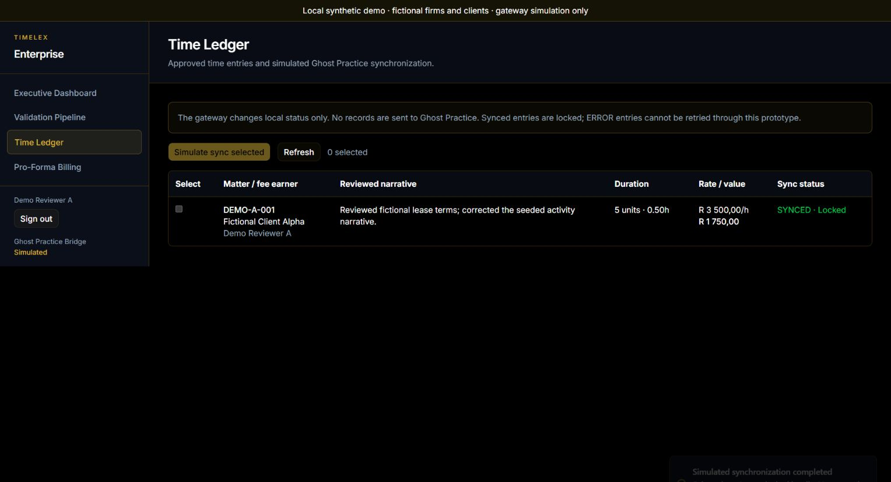

# TimeLex v2

A legal time-review prototype by Kone Tshivhinda. It provides tenant-scoped
drafts, matter assignment, approval into a visible time ledger and a simulated
synchronization gateway. Pro-forma billing is a planned feature.

[](https://github.com/konethegreat/timelex-automated-time-tracking-v2/actions/workflows/ci.yml)

**Try the [reproducible synthetic walkthrough](docs/DEMO.md).** It builds and runs
the actual Next.js application against a new local PostgreSQL database, with
fictional firms and clients, normal password sign-in and no provider credentials.



## Current scope

This repository is a prototype. The Ghost Practice gateway updates local ledger
state and returns a simulated success or failure; it does not send records to
a live practice-management system. Microsoft Entra sign-in is optional, and
automatic Microsoft Graph activity ingestion and a live AI narrative service
are not established by the current implementation.

The implemented workflow is:

1. Sign in as a user belonging to an organization.
2. Review that organization's time drafts and assign matters.
3. Approve drafts into ledger entries, priced in six-minute units.
4. Send selected pending entries through the simulated gateway.
5. View synchronized entries with their sync lock and reviewed duration/value.

The 146 unit tests include the fake Prisma database suite and dependency audit
policy regression checks. A separate 36-check HTTP workflow
uses real Auth.js sessions, the production Next.js server and disposable
PostgreSQL. It covers cross-firm access denial, duration edits, duplicate and
concurrent approval, decimal rounding, simulated success and failure. These are
local/CI checks, not proof of a hosted deployment or live provider integrations.

## Stack

Next.js **16.3.8**, React **19.2.8**, TypeScript, Auth.js **5.0.0-beta.32**,
Prisma **7.10.0**, PostgreSQL, and Tailwind CSS. The package lock records the installed
dependency versions. Use Node.js 24, matching CI and the package engine range.

## Reproduce the demonstration

Use Node.js 24 and a running Docker engine:

```bash
git clone https://github.com/konethegreat/timelex-automated-time-tracking-v2.git
cd timelex-automated-time-tracking-v2
npm ci
npm run demo:verify
```

The verifier creates and removes its own PostgreSQL 16 container, generates
temporary credentials, seeds two fictional firms, builds the application, and
checks the actual HTTP routes. It restarts its server to exercise simulated
gateway rejection. It overrides your configured database URL and does not write .env
files. Build artifacts remain in the gitignored `.next` directory.

For the interface, supply a temporary password of at least 12 characters:

```powershell
$env:DEMO_PASSWORD = Read-Host 'Temporary local demo password' -MaskInput
npm run demo
```

The walkthrough also provides the equivalent Bash commands.

The launcher prints a loopback login URL. Sign in as
`demo.reviewer.a@example.com` with your supplied password. [The walkthrough](docs/DEMO.md)
lists the other accounts, expected values and screenshots. Stop with Ctrl+C to
discard the database. Run one demo per checkout: the launcher rebuilds `.next`.

## Regular development

Copy `.env.example` to an untracked `.env`, configure your own development
PostgreSQL `DATABASE_URL`, generate a fresh random `AUTH_SECRET`, and run
`npm run db:push` followed by `npm run dev`. Provision users for that database
separately. The demo seed now refuses populated/non-local databases, requires a
password and is invoked by the disposable launcher; it deletes no organization.

Real credentials belong in the gitignored `.env`, never in the example.
The development authentication shortcut is off by default and also requires
`NODE_ENV=development`. Prefer normal credentials sign-in for workflow checks.

## Optional settings

| Variable | Purpose |
| --- | --- |
| `AUTH_MICROSOFT_ENTRA_ID_ID`, `AUTH_MICROSOFT_ENTRA_ID_SECRET`, `AUTH_MICROSOFT_ENTRA_ID_ISSUER` | Optional Entra identity provider; sign-in must still map to a provisioned tenant user |
| `SYNC_GATEWAY_SIMULATE_FAILURE` | Set to `true` to exercise the simulated gateway error path |
| `ALLOW_DEV_AUTH_BYPASS`, `DEV_SESSION_USER_ID`, `DEV_SESSION_ORG_ID` | Explicit local development shortcut; never enable on a shared instance |
| `NEXT_PUBLIC_TIMELEX_DEMO_MODE` | Build-time fictional-data banner; set by the disposable launcher |

## Development checks

```bash
npm run lint
npm run audit
npm run typecheck
npm test
npm run build
npm run demo:verify
```

Unit tests do not require a database. The build imports the Prisma client and needs
a syntactically valid `DATABASE_URL`; CI uses a non-listening placeholder
address. The separate PostgreSQL workflow job builds and runs against a new
database; it still contacts no external gateway. Browser screenshots are manual
evidence and are not automated UI tests.

## Access and current limits

Draft and ledger lists show fee earners their own records and firm admins their
organization's records. The dashboard is firm-wide. Existing edit, approval and
sync APIs enforce organization boundaries; they do not yet implement a complete
per-role or per-owner write policy. The ledger lists the latest 100 entries and
explicitly reports when older entries are omitted. Approval uses the approving
user's rate; approval by an admin is not a separate supervisory approval stage.

Activity drafts are seeded, not ingested from Microsoft Graph. Narrative editing
is manual, without a live AI service. The Ghost Practice bridge is simulated;
ERROR entries have no retry action yet. Bulk approval and billing/PDF export are
not implemented. The duration field is bounded to 1–240 six-minute units.

The October 3, 2026 dependency refresh reduced the full npm audit from 32 findings
to five high development findings, all from one unpatched advisory in Next.js's
lint chain. The production dependency audit is zero. `npm run audit` and CI reject
any other finding or runtime use of the reviewed exception. See
[dependency details and remaining tooling work](docs/DEPENDENCIES.md). The build
uses the current `proxy.ts` convention, and lint has no warnings.

## Contributing

Open an issue with reproduction steps or a focused pull request. Include the
checks you ran and whether the behavior was verified with mocked or live services.
Avoid sharing law-firm records, client information, session tokens, or credentials.

[The original TimeLex repository](https://github.com/konethegreat/timelex-automated-time-tracking)
contains an earlier iteration. This repository is the focus of current development.
