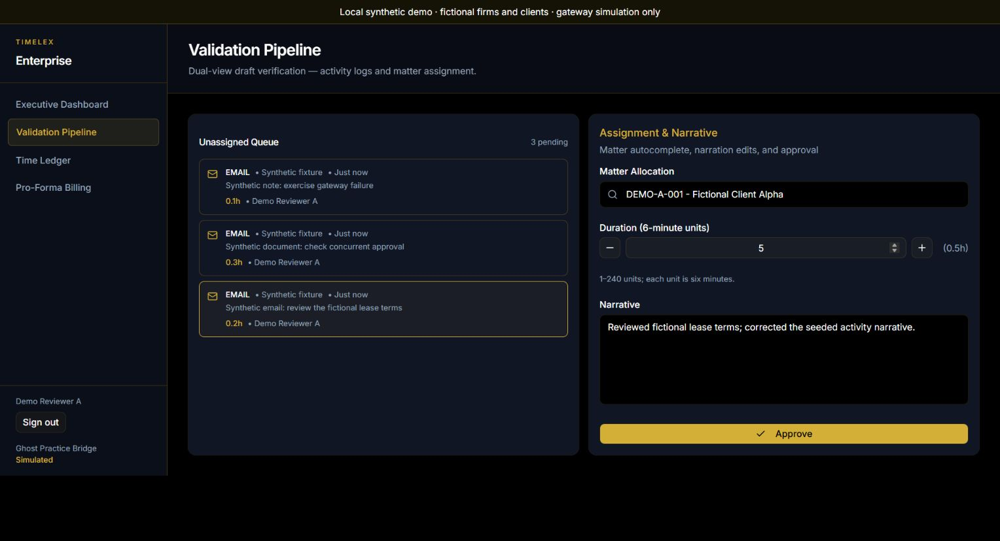
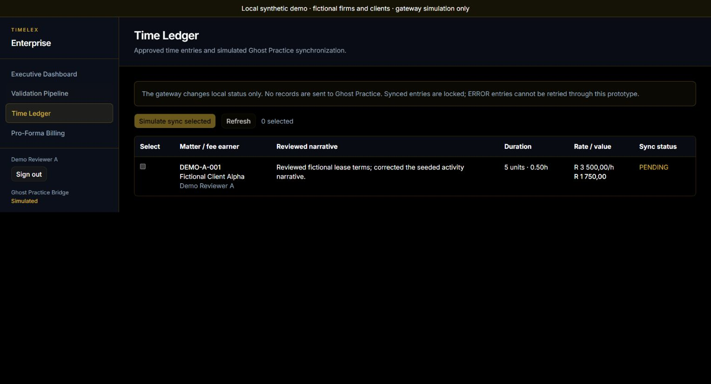

# Synthetic local walkthrough

This demonstrates seeded activity → draft review → approval → visible ledger →
simulated synchronization. All firms, users, clients and narratives are fictional.
It does not demonstrate automatic capture, AI generation, real Ghost Practice
delivery or billing PDF export.

## Start from a fresh clone

With Node.js 24 and Docker running:

```sh
git clone https://github.com/konethegreat/timelex-automated-time-tracking-v2.git
cd timelex-automated-time-tracking-v2
npm ci
npm run demo:verify
```

This runs 36 HTTP checks with real credentials sign-in, a production Next.js
build and fresh PostgreSQL 16. It verifies organization boundaries, fee-earner
lists, review edits, rejected durations, single/concurrent approval, exact rand
values, synchronization lockout and the simulated 502/ERROR failure path. The
seed is also checked for refusal to overwrite the populated database.

For the browser:

```powershell
$env:DEMO_PASSWORD = Read-Host 'Temporary local demo password' -MaskInput
npm run demo
```

For Bash, read and export the password without printing it:

```bash
read -rs -p 'Temporary local demo password: ' DEMO_PASSWORD
export DEMO_PASSWORD
npm run demo
```

The password must have at least 12 characters. Open the printed loopback URL.
No configured .env file is needed. The launcher overrides the database/auth
settings, disables the development bypass and optional providers, and passes
credentials only to its child processes. It never prints the password or saves
it to a file. The local app/database have fresh ports and data on each launch.
The Next.js build can fetch its Google font and needs network access on a clean
cache; this is not a fully offline demonstration.

Run one instance per checkout because each launch rebuilds `.next`. Ctrl+C stops
the owned server and removes its container. It does not stop unrelated containers.
Build/install artifacts remain gitignored for subsequent development.

## Fictional accounts

All four accounts use your supplied password.

| Account | Role | Expected scope |
|---|---|---|
| demo.reviewer.a@example.com | Fee earner, firm A | Three own drafts; R3500/hour |
| demo.colleague.a@example.com | Fee earner, firm A | One separate draft; R2200/hour |
| demo.admin.a@example.com | Firm admin, firm A | All four firm A drafts |
| demo.reviewer.b@example.com | Fee earner, firm B | One separate draft and an existing ledger entry; R1000.55/hour |

Firm A has the active `DEMO-A-001` matter and a closed matter; searches exclude
the closed one. Firm B has `DEMO-B-001`. Platforms are labelled `Synthetic fixture`
to distinguish seeded drafts from connected Outlook/Teams capture.

## Review and approve

1. Sign in as `demo.reviewer.a@example.com`.
2. Open **Validation Pipeline** and select **Synthetic email: review the fictional lease terms**.
3. Select **DEMO-A-001 — Fictional Client Alpha**.
4. Change duration from **2** to **5** units: 30 minutes, or 0.5 hours.
5. Replace the narrative with **Reviewed fictional lease terms; corrected the seeded activity narrative.**
6. Click **Approve**. The draft leaves the queue.



## Inspect the approved entry

Open **Time Ledger**. The reviewed narrative, matter and duration should be
present, with `PENDING` status and **R1750.00** value:

`5 units × 6 minutes ÷ 60 × R3500/hour = R1750.00`.



## Simulate synchronization

Select the entry checkbox and click **Simulate sync selected**. The entry changes
to `SYNCED · Locked`; the checkbox and sync button become unavailable for that
entry. Refreshing/revisiting the page retains the status. No external record was
sent. The HTTP verifier also checks that a repeat request returns 409.


## Check a second firm

Use **Sign out**, then sign in as `demo.reviewer.b@example.com`. Its ledger shows
the fictional firm B entry, valued at R200.11, and excludes the reviewed firm A
entry. Its draft/matter lists also exclude firm A. The HTTP verifier attempts
cross-firm edits, assignment and synchronization; each is rejected.


## Recorded evidence and limits

The October 3, 2026 Windows checks use Node.js 26.8.1; CI uses Node.js 24. The
146 unit tests, typecheck, lint (no warnings), production build and
36-check PostgreSQL verifier pass. The browser walkthrough separately verifies
review edits, approval value, sync lockout, firm B visibility and sign-out.
These screenshots are from that real local browser run.

The ledger view is bounded to the latest 100 entries and reports omitted older
entries. Dashboard metrics are organization-wide. Existing write routes are
organization-scoped, not a complete policy for separate fee-earner/administrator
approval. Approval uses the approving user's rate. `ERROR` retry, bulk approval,
automatic activity capture, AI narratives and PDF billing are not implemented.
The production dependency audit is zero. The full audit retains five high
development findings from one unpatched lint-chain advisory, described in
[DEPENDENCIES.md](DEPENDENCIES.md). The middleware convention has been migrated
to `proxy.ts`; ESLint's supported-major migration remains follow-up work.
